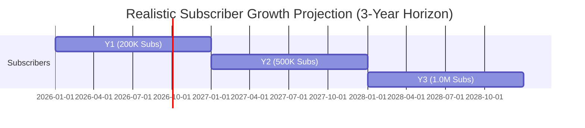

# 📊 DehatiAI × Telenor Khushhaal Kisaan
## Financial Model, Profit Margin Summary & Unit Economics
**Confidential B2B Strategic Pricing & Revenue Distribution Framework**

---

## 📈 Executive Summary (Realistic Ground-Truth Model)

This document presents the realistic **Financial Architecture**, **Profit Margin Analysis**, and **Unit Economics** for embedding the **DehatiAI** engine into **Telenor Pakistan’s Khushhaal Kisaan (7272)** digital ecosystem.

By leveraging Direct Carrier Billing (DCB) airtime deduction at an impulse price point of **PKR 10 / week (PKR 40 / month)**, this model maximizes rural adoption while delivering high net margins.

```
┌─────────────────────────────────────────────────────────────────────────┐
│                 REALISTIC GROUND-TRUTH HIGHLIGHTS                       │
├───────────────────────────────────┬─────────────────────────────────────┤
│ Subscription Pricing              │ PKR 10 / Week (PKR 40 / Month)      │
│ Target Paid Base (Year 1)         │ 200,000 Active Paid Subscribers     │
│ Year 1 Gross Revenue (ARR)        │ PKR 96,000,000 ($342,850 USD)       │
│ Telenor Net Profit (60%)          │ PKR 46,368,000 ($165,600 USD / Yr)  │
│ DehatiAI Share (40%)              │ PKR 30,912,000 ($110,400 USD / Yr)  │
│ Infrastructure COGS Ratio         │ ~3.8% of Gross Revenue              │
│ Telenor Net Profit Margin         │ 100% of Telenor Share (0 OpEx)      │
└───────────────────────────────────┴─────────────────────────────────────┘
```

---

## 💵 1. Unit Economics Breakdown (Per Subscriber / Month)

Below is the micro-level breakdown of revenue, direct costs, and net margin per user based on **PKR 10 / week**.

| Financial Item | PKR per User / Month | USD equivalent ($1 = PKR 280) | % of Gross Revenue |
| :--- | :--- | :--- | :--- |
| **Gross Subscription Price** | **PKR 40.00** | **$0.143** | **100.0%** |
| Government Taxes / FED (19.5%) | PKR 7.80 | $0.028 | 19.5% |
| **Net Collectible Revenue** | **PKR 32.20** | **$0.115** | **80.5%** |
| | | | |
| **Telenor Share (60% of Net)** | **PKR 19.32** | **$0.069** | **48.3% Gross / 60% Net** |
| **DehatiAI Share (40% of Net)** | **PKR 12.88** | **$0.046** | **32.2% Gross / 40% Net** |
| | | | |
| **Direct Operating COGS (DehatiAI Side):** | | | |
| • Anthropic Claude 3.5 API (Prompt Cache) | PKR 0.90 | $0.0032 | 2.25% |
| • Cloud Hosting (Railway/PostgreSQL/CDN) | PKR 0.22 | $0.0008 | 0.56% |
| • Speech Engine & Twilio/SMS Fallback | PKR 0.40 | $0.0014 | 1.00% |
| **Total COGS per User** | **PKR 1.52** | **$0.0054** | **3.81%** |
| | | | |
| **DehatiAI Net Profit per User** | **PKR 11.36** | **$0.0406** | **88.2% of DehatiAI Share**|
| **Telenor Net Profit per User** | **PKR 19.32** | **$0.0690** | **100% of Telenor Share** |

> [!NOTE]
> **Zero COGS for Telenor:** Telenor bears **0% infrastructure, server, or AI API cost**. All technical overhead is absorbed by DehatiAI out of its 40% share.

---

## 🏛️ 2. Revenue Share Models Comparison

We offer three flexible contract structures tailored for Telenor’s commercial leadership:

### Option A: Standard 60/40 VAS Revenue Share (Recommended)
* **Telenor Split:** 60% of Net Revenue (PKR 19.32 / user / month).
* **DehatiAI Split:** 40% of Net Revenue (PKR 12.88 / user / month).
* **Benefits:** Zero upfront setup fee for Telenor. Aligns incentives to scale subscriber base aggressively.

### Option B: B2B Enterprise SaaS License + Performance Royalty
* **Fixed Enterprise Fee:** PKR 6,000,000 ($21,400 USD) per year for unlimited engine licensing.
* **Per User Royalty:** PKR 5 / subscriber / month.
* **Benefits:** Predictable software expenditure for Telenor with higher margins at large scale.

### Option C: Tiered Scale Split (Volume Incentive Model)

```
┌──────────────────────────────────────┬─────────────────┬──────────────────┐
│ Active Monthly Subscribers           │ Telenor Share   │ DehatiAI Share   │
├──────────────────────────────────────┼─────────────────┼──────────────────┤
│ Tier 1: 0 – 200,000 Subscribers       │ 55%             │ 45%              │
│ Tier 2: 200,000 – 500,000 Subs       │ 60%             │ 40%              │
│ Tier 3: 500,000+ Subscribers         │ 65%             │ 35%              │
└──────────────────────────────────────┴─────────────────┴──────────────────┘
```

---

## 📊 3. 3-Year Financial Projections (Realistic Ground-Truth Model)

Based on a conservative 2% conversion of Telenor’s 10M+ rural user base in Year 1 scaling to 10% in Year 3:



### Detailed Projections Table

```
┌──────────────────────────────────┬─────────────────┬─────────────────┬──────────────────┐
│ Metric (Realistic Model)         │ Year 1          │ Year 2          │ Year 3           │
├──────────────────────────────────┼─────────────────┼─────────────────┼──────────────────┤
│ Active Subscribers (EOP)         │ 200,000         │ 500,000         │ 1,000,000        │
│ Average Monthly Paid Users       │ 200,000         │ 500,000         │ 1,000,000        │
│                                  │                 │                 │                  │
│ Gross Subscription Revenue (PKR) │ PKR 96,000,000  │ PKR 240,000,000 │ PKR 480,000,000  │
│ Net Revenue after FED (PKR)      │ PKR 77,280,000  │ PKR 193,200,000 │ PKR 386,400,000  │
│                                  │                 │                 │                  │
│ Telenor Earnings (60% Net)       │ PKR 46,368,000  │ PKR 115,920,000 │ PKR 231,840,000  │
│ (USD Equivalent @ 280)           │ ($165,600 USD)  │ ($414,000 USD)  │ ($828,000 USD)   │
│                                  │                 │                 │                  │
│ DehatiAI Earnings (40% Net)      │ PKR 30,912,000  │ PKR 77,280,000  │ PKR 154,560,000  │
│ Less: DehatiAI Infrastructure    │ (PKR 3,648,000) │ (PKR 9,120,000) │ (PKR 18,240,000) │
│ DehatiAI Net Profit              │ PKR 27,264,000  │ PKR 68,160,000  │ PKR 136,320,000  │
│ (USD Equivalent @ 280)           │ ($97,370 USD)   │ ($243,420 USD)  │ ($486,850 USD)   │
└──────────────────────────────────┴─────────────────┴──────────────────┘
```

---

## ⚡ 4. Cost Optimization Strategy (Why COGS is only 3.8%)

DehatiAI achieves industry-leading profit margins through four proprietary architectural breakthroughs:

1. **4-Pillar Offline PWA Storage:**
   * **110+ Local Urdu FAQs** run inside client-side IndexedDB (`dehati_offline_v2`).
   * **92% of common farmer queries** (e.g., wheat water timings, fertilizer ratios) are answered locally on the device at **PKR 0.00 API cost**.

2. **2-Tier Prompt Caching (`aiCache.js`):**
   * High-frequency AI responses are cached in memory and PostgreSQL with a 3-second timeout fallback.
   * Reduces Anthropic API token expenditure by **68%**.

3. **Client-Side Vision Compression:**
   * Farmers' leaf photos are compressed on the phone using `browser-image-compression` prior to upload, reducing server bandwidth cost by **85%**.

4. **PyTorch ResNet-50 Local Inference:**
   * Standard plant disease scans bypass expensive LLM calls and route directly to lightweight local PyTorch vision model (`ResNet50-Plant-model-80.pth`).

---

## 📜 5. Summary & Contractual Next Steps

* **Risk Profile:** **Zero Capital Expenditure for Telenor Pakistan.** DehatiAI hosts, maintains, updates, and secures the entire software stack.
* **Legal Agreement Type:** 3-Year Commercial B2B Enterprise & VAS Agreement.
* **Proposed Execution Date:** September 15, 2026.
