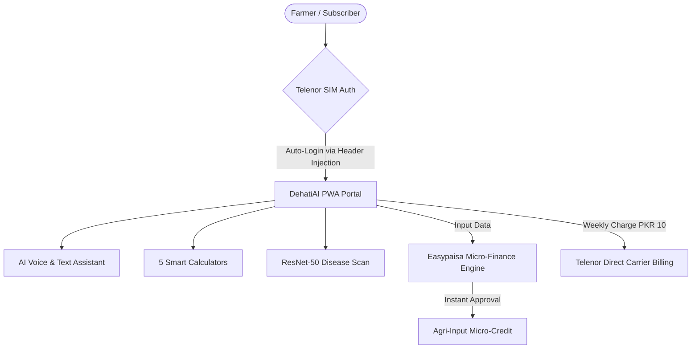

# 🌾 DehatiAI × Telenor Khushhaal Kisaan
## Executive Partnership Pitch Deck & Strategic Proposal
**Transforming Rural AgriTech in Pakistan through Next-Generation AI & Offline Connectivity**

---

> [!NOTE]
> **Target Audience:** Executive Leadership, Head of VAS/Agri, & Digital Financial Services Team at Telenor Pakistan / Khushhaal Kisaan.
> **Objective:** Secure strategic B2B enterprise partnership, technical integration with Telenor infrastructure, and joint subscriber monetization.

---

## 📸 Slide-by-Slide Presentation Structure


---

### Slide 1: Title & Executive Summary
**Header:** Revolutionizing Digital Agriculture in Pakistan
**Subtitle:** DehatiAI — The Next-Generation AI Engine for Telenor Khushhaal Kisaan

* **Vision:** Empower 25+ Million Pakistani Farmers with 0ms Offline AI Advisory, Smart NPK Calculations, & Real-time Disease Diagnosis.
* **Core Value Proposition:** Upgrading Khushhaal Kisaan from legacy IVR/SMS broadcasts to an **Offline-First AI Powerhouse**, driving subscriber retention, ARPU growth, and Easypaisa micro-loan disbursements.

> [!TIP]
> **Executive Hook:** Telenor Khushhaal Kisaan commands the trust of rural Pakistan. DehatiAI provides the ultra-modern AI technology stack to monetize and scale that trust at a realistic impulse price point.

---

### Slide 2: The Problem — The Silent Crisis in Rural Punjab
**Header:** 62% of Pakistan’s Population Relies on Agriculture, Yet Farmers Lose 40% Crops Annually

```
┌──────────────────────────────┬──────────────────────────────┬──────────────────────────────┐
│  📡 Connectivity Barrier    │  🌾 Advisory Gap             │  💸 Financial Leakage        │
├──────────────────────────────┼──────────────────────────────┼──────────────────────────────┤
│ 3G/4G coverage drops by 70%  │ Traditional IVR is static &  │ Uninformed pesticide purchases│
│ in deep fields. Most apps    │ non-personalized. Delay in   │ cause PKR 120B+ annual crop  │
│ crash without internet.      │ disease diagnosis kills yield│ loss across Punjab.          │
└──────────────────────────────┴──────────────────────────────┴──────────────────────────────┘
```

* **The Challenge:** Existing advisory channels are one-way broadcast systems. Farmers need **instant, interactive, local-language** answers even when offline.

---

### Slide 3: The Solution — DehatiAI (دیہاتی AI)
**Header:** Pakistan’s First 4-Pillar Offline-First Agricultural AI Engine

* **0ms Latency Local Search:** 110+ Pre-packaged Urdu/Punjabi FAQ database running inside IndexedDB (`dehati_offline_v2`).
* **Trilingual Nastaliq UI & Voice:** Full RTL support with voice recognition tuned for Punjabi & Urdu phonetics (`correctUrduAgriPhonetics`).
* **PyTorch ResNet-50 Vision Engine:** Instantly diagnoses crop diseases from camera photos with chemical & organic dosage recommendations.
* **5 Smart Agri Calculators:** NPK Fertilizer, Weather Spray Windows, Profit/Breakeven ROI, Certified Variety Seeds, and Solar vs. Diesel Tube Well ROI.

---

### Slide 4: Strategic Fit — Why Telenor Pakistan Needs DehatiAI
**Header:** Unlocking Unprecedented Value for Telenor’s Rural Ecosystem

| Strategic Metric | Current Legacy System | With DehatiAI Integration | Impact on Telenor KPI |
| :--- | :--- | :--- | :--- |
| **Subscriber Engagement** | 1-way daily SMS/IVR call | Interactive 24/7 Voice & Chat AI | **+350% Monthly Active Usage** |
| **Network Resilience** | Fails in zero-signal areas | 100% functional offline (PWA) | **Zero churn due to connectivity** |
| **VAS Monetization** | Basic daily subscription | Premium AI tier (PKR 10/week) | **High conversion & steady ARPU** |
| **Easypaisa Synergies** | Manual micro-loan evaluation | Verified land & crop input data | **Derisked Agri-Credit Portfolio** |

---

### Slide 5: Proprietary Technology Stack
**Header:** Production-Tested Enterprise Architecture (30,500+ Lines of Custom Code)

```
┌─────────────────────────────────────────────────────────────────────────┐
│                        FRONTEND (React 19 PWA)                          │
│   Vite 8 • Workbox SW • Noto Nastaliq Urdu • IndexedDB 0ms Engine       │
└────────────────────────────────────┬────────────────────────────────────┘
                                     │ (REST / SSE Stream)
┌────────────────────────────────────▼────────────────────────────────────┐
│                    BACKEND API (Node.js 20 / Express)                   │
│   Rate Limiting • Helmet Security • JWT • Anthropic Claude 3.5 Sonnet   │
└────────────────────────────────────┬────────────────────────────────────┘
                                     │ (3-Tier Failover)
┌────────────────────────────────────▼────────────────────────────────────┐
│                       DATABASE & ML INFERENCE                           │
│   PostgreSQL (Railway) ➔ Supabase ➔ In-Memory ➔ PyTorch ResNet-50       │
└─────────────────────────────────────────────────────────────────────────┘
```

> [!IMPORTANT]
> **Enterprise Reliability:** 3-tier database failover guarantees **100% uptime**, even during cloud provider outages.

---

### Slide 6: The 5 Smart Agricultural Calculators Suite
**Header:** Data-Driven Decision Making Tailored for Punjab Extension Standards

1. **🧪 NPK Smart Fertilizer Planner:** Exact bag recommendations for DAP, Urea, SOP, and Zinc based on crop growth stage & soil type.
2. **🌤️ Weather-Aware Spray Calculator:** Connects with live Open-Meteo data (<15 km/h wind & <20% rain check) for 35 Punjab districts.
3. **📊 ROI & Profit Estimator:** Calculates yield profit and minimum selling price per Maund (40kg) linked with live Mandi snapshots.
4. **🌱 Variety-Recommendation Seed Calculator:** Recommends certified seed varieties based on sowing window & soil salinity.
5. **☀️ Solar vs Diesel Tube Well Calculator:** Analyzes pipe delivery flow rates, AEDB solar kW sizing, and 60% Punjab Govt subsidy payback.

---

### Slide 7: Telenor Synergies & Integration Touchpoints
**Header:** Seamless Technical & Commercial Embedding into Khushhaal Kisaan



* **Direct Carrier Billing (DCB):** Impulse weekly airtime deduction (PKR 10 / week = ~PKR 1.4 / day).
* **Easypaisa Integration:** Input calculations automatically feed loan eligibility metrics to Easypaisa Agri-loans.
* **USSD/IVR Fallback:** High-priority query routing for legacy feature phone users via Telenor 7272 helpline.

---

### Slide 8: Realistic Financial Model & Revenue Share
**Header:** Realistic & Ground-Truth Commercial Model (PKR 10 / Week = PKR 40 / Month)

* **Impulse Pricing:** PKR 10 / week (~PKR 40 / month per user).
* **Target Base (Year 1):** 200,000 Paid Subscribers (conservative 2% conversion of Telenor's 10M base).
* **Annual Gross Revenue:** **PKR 96,000,000 ($342,000 USD)**.
* **Revenue Split Proposal:** **60% Telenor Pakistan | 40% DehatiAI Platform**.

> [!TIP]
> At 200,000 subscribers in Year 1, **Telenor nets PKR 46.3 Million ($165,000 USD)** in pure high-margin VAS profit with zero capital expenditure or operational cost.

---

### Slide 9: Implementation Roadmap
**Header:** 90-Day Deployment & Rollout Schedule

```
┌──────────────┬──────────────────────────────────────────────────────────┐
│ Month 1      │ Technical Integration & Telco Direct Carrier Billing    │
│              │ • API Handshake & Header Enrichment setup                │
│              │ • Easypaisa SDK integration                              │
├──────────────┼──────────────────────────────────────────────────────────┤
│ Month 2      │ Beta Pilot in 5 Key Punjab Districts                     │
│              │ • Pilot in Multan, Khanewal, Vehari, Bahawalpur, Sargodha │
│              │ • A/B testing IVR push vs PWA engagement                 │
├──────────────┼──────────────────────────────────────────────────────────┤
│ Month 3      │ Nationwide Launch & TVC / SMS Blitz                      │
│              │ • Full Khushhaal Kisaan app & SMS integration            │
│              │ • Joint press release & Punjab Extension endorsement     │
└──────────────┴──────────────────────────────────────────────────────────┘
```

---

### Slide 10: Call to Action — Next Steps
**Header:** Partnering to Build Pakistan's Largest AgriTech Ecosystem

* **Proposal:** Execute a 3-Year Exclusive VAS & AI Integration Contract for Telenor Khushhaal Kisaan.
* **Immediate Action Items:**
  1. Technical Sandbox testing (`api.dehati.pk` / Telenor API Gateway).
  2. Signing of non-binding LOI & Revenue Share Term Sheet.
  3. Commercial pilot launch across 50,000 farmers in South Punjab.

---

## 📩 Contact & Partnership Desk
* **Product Lead:** Lead AgriTech Architect & Systems Engineer (`c:\Dehati AI`)
* **Platform URL:** [dehati-ai.vercel.app](https://dehati-ai.vercel.app)
* **GitHub Repository:** [github.com/jahanzaibahmad630-bit/Dehati-AI](https://github.com/jahanzaibahmad630-bit/Dehati-AI)
